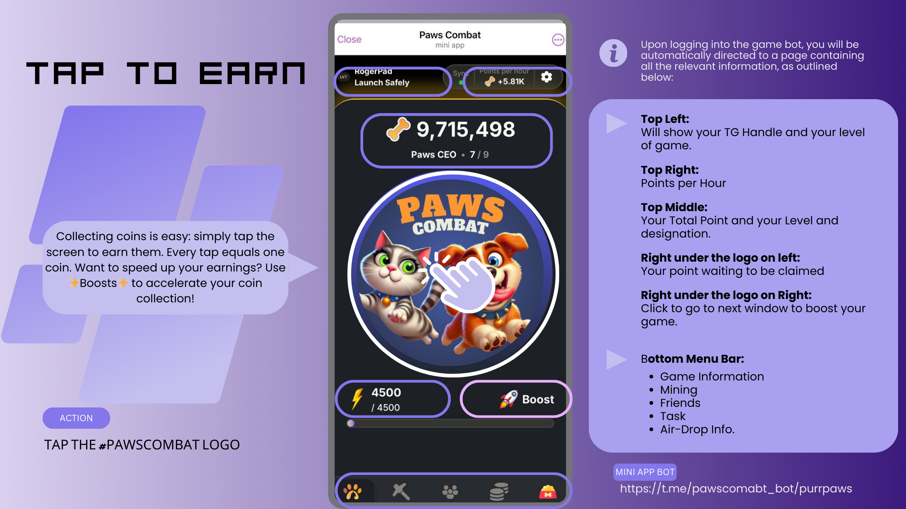
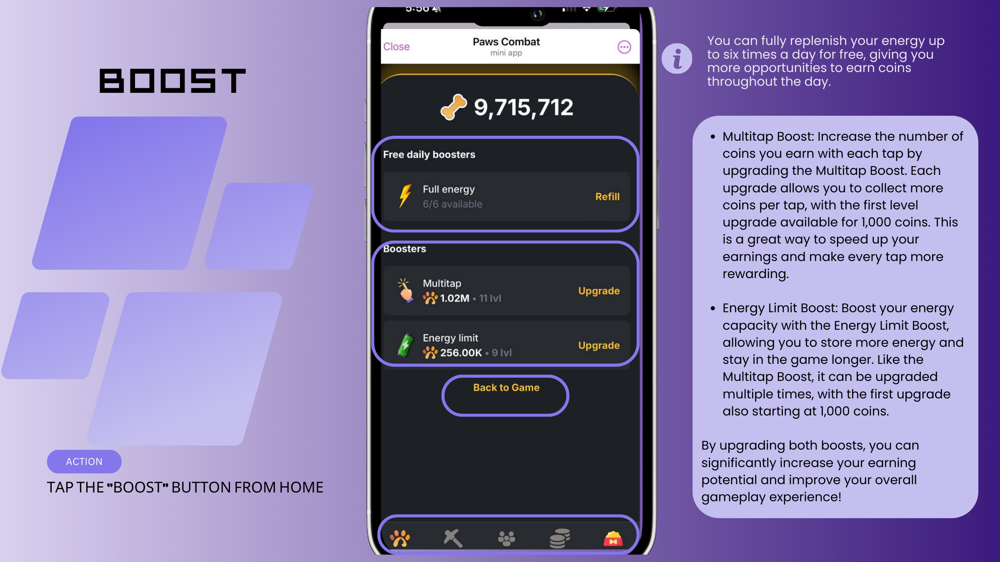
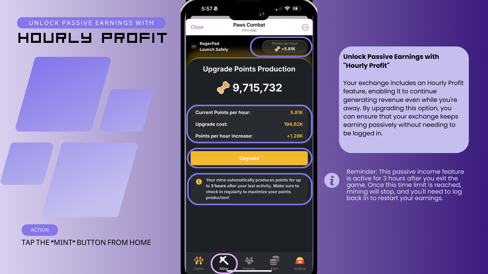
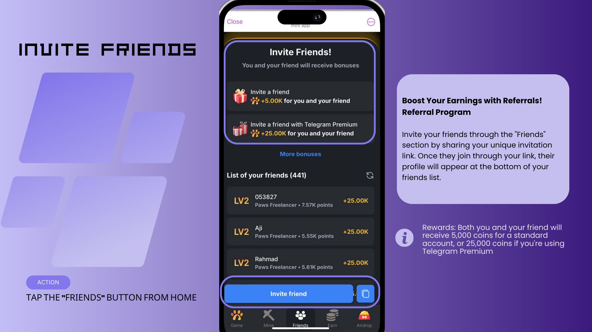
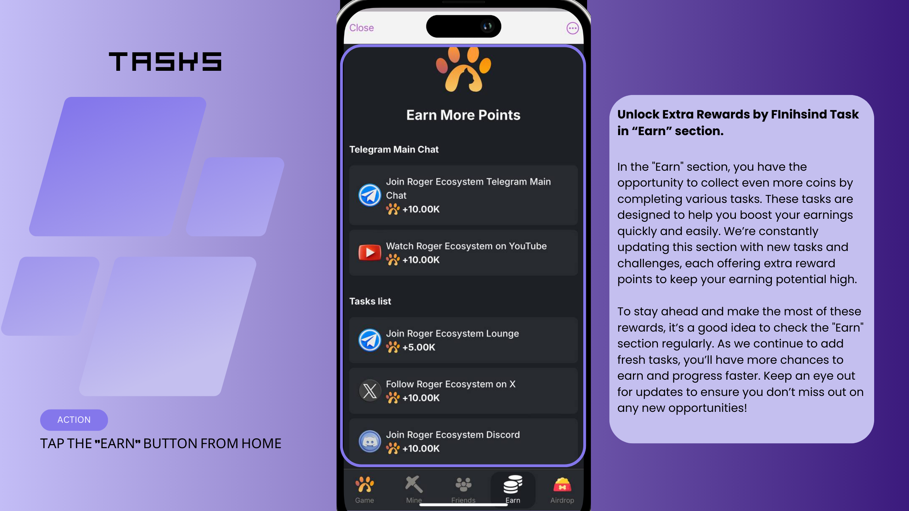

# Paws Combat USER'S GUIDE

#### 🐾 **Paws Combat: Play, Earn, and Dominate!** 🐾

<figure><figcaption></figcaption></figure>

Get ready for the ultimate **play-to-earn (P2E)** experience with **Paws Combat**, the flagship game of the **PurrPaws ecosystem**! 🎮💥 Engage in thrilling battles, complete exciting tasks, and earn **Bones** as rewards, which can be converted into **PurrPaws ($PPAWS)** tokens! 💰💪

But that’s not all—Paws Combat is more than just a game. It’s deeply connected to the **Roger Eco System**, giving **Roger NFT** holders exclusive perks that boost the value of their NFTs and unlock additional benefits in the game. 🚀🎁

Join the Paws Combat community, climb the leaderboards, and take full advantage of these perks as you battle your way to crypto glory! 🌟💥 **Start playing, start earning, and start winning today!**

### 1. Join the #PawsCombat Game

<figure><figcaption></figcaption></figure>

To play the #PawsCombat game, login to[ https://t.me/pawscobat\_bot ](https://t.me/pawscombat\_bot/purrpaws)directly or click the link you received fro myour truscted sources or friend.

### 2. Welcoem to #PawsCombat by [Broken link](broken-reference "mention")

<figure><figcaption></figcaption></figure>

 

<figure><figcaption></figcaption></figure>


As we expand, we will have more in this menu. Please check periodically.


### 3. Tap-2-Earn&#x20;

<figure><figcaption></figcaption></figure>

 

<figure><figcaption></figcaption></figure>

> ACTION: TAP THE #PAWSCOMBAT LOG


Upon logging into the game bot, you will be automatically directed to a page containing all the relevant information, as outlined below:


Collecting coins is easy: simply tap the screen to earn them. Every tap equals one coin. Want to speed up your earnings? Use ✨Boosts✨ to accelerate your coin collection!

***

Top Left: Will show your TG Handle and your level of game.

Top Right: Points per Hour

Top Middle: Your Total Point and your Level and designation.

Right under the logo on left: Your point waiting to be claimed

Right under the logo on left: Your point waiting to be claimed

Bottom Menu Bar:

* Game Information
* Mining
* Friends
* Task
* Air-Drop Info.

### 4. Boost

<figure><figcaption></figcaption></figure>

 

<figure><figcaption></figcaption></figure>

> ACTION: TAP THE “BOOST” BUTTON FROM HOME


You can fully replenish your energy up to six times a day for free, giving you more opportunities to earn coins throughout the day.


* Multitap Boost: Increase the number of coins you earn with each tap by upgrading the Multitap Boost. Each upgrade allows you to collect more coins per tap, with the first level upgrade available for 1,000 coins. This is a great way to speed up your earnings and make every tap more rewarding.
* Energy Limit Boost: Boost your energy capacity with the Energy Limit Boost, allowing you to store more energy and stay in the game longer. Like the Multitap Boost, it can be upgraded multiple times, with the first upgrade also starting at 1,000 coins.

By upgrading both boosts, you can significantly increase your earning potential and improve your overall gameplay experience!

### 5. Hourly Profit

<figure><figcaption></figcaption></figure>

 

<figure><figcaption></figcaption></figure>

> ACTION: TAP THE “MINT” BUTTON FROM HOME

**Unlock Passive Earnings with "Hourly Profit"**

Your exchange includes an Hourly Profit feature, enabling it to continue generating revenue even while you're away. By upgrading this option, you can ensure that your exchange keeps earning passively without needing to be logged in.


Reminder: This passive income feature is active for 3 hours after you exit the game. Once this time limit is reached, mining will stop, and you'll need to log back in to restart your earnings.


### 6. Invite FRIENDS and Earn More

<figure><figcaption></figcaption></figure>

 

<figure><figcaption></figcaption></figure>

> ACTION: TAP THE “FRIENDS” BUTTON FROM HOME

**Boost Your Earnings with Referrals!**

Referral Program

Invite your friends through the "Friends" section by sharing your unique invitation link. Once they join through your link, their profile will appear at the bottom of your friends list.


Rewards: Both you and your friend will receive 5,000 coins for a standard account, or 25,000 coins if you're using Telegram Premium


### Level UP with Referrals

<figure><figcaption></figcaption></figure>

 

<figure><figcaption></figcaption></figure>

> ACTION: TAP THE “FRIENDS” BUTTON FROM HOME

**Unlock Extra Rewards as Your Friends Level Up!**

As your referred friends progress and reach certain exchange levels, you'll be rewarded with extra bonuses! These bonuses are tied to their achievements, meaning the more they advance, the more rewards you earn.

To see the full list of rewards and understand the specific milestones that trigger these bonuses, click on the "More bonuses" section for detailed information. It's a great way to earn even more while supporting your friends' success!

### 8. Tasks to Earn even More

<figure><figcaption></figcaption></figure>

 

<figure><figcaption></figcaption></figure>

> ACTION: TAP THE “EARN” BUTTON FROM HOME

**Unlock Extra Rewards by FInihsind Task in “Earn” section.**

In the "Earn" section, you have the opportunity to collect even more coins by completing various tasks. These tasks are designed to help you boost your earnings quickly and easily. We’re constantly updating this section with new tasks and challenges, each offering extra reward points to keep your earning potential high.

To stay ahead and make the most of these rewards, it’s a good idea to check the "Earn" section regularly. As we continue to add fresh tasks, you’ll have more chances to earn and progress faster. Keep an eye out for updates to ensure you don’t miss out on any new opportunities!

### 9. Air Drop $PPAWS

<figure><figcaption></figcaption></figure>

 

<figure><figcaption></figcaption></figure>

> **ACTION: TAP THE “AIR DROP” BUTTON FROM HOME**

🚨 Airdrop Alert: Unlock the Power of #PawsCombat! 🚨

The airdrop is your gateway to the #PawsCombat game bot! 🎮🐾 Start playing with "Paws" and rack up "Bones" as you support the project and spread the word! 🗣️🐾

The best part? You can convert your Bones into $PPAWS once PurrPaws officially launches on the Base Chain. 🚀💰 From there, you can swap $PPAWS for real money and cash in on your winnings! 💸🎉

Get involved, share the memes, and join the fun! 🎉

The more you play, the more you earn! Let’s go #PawsCombat! 🐾🔥

👉 Support, earn, and make it big!
