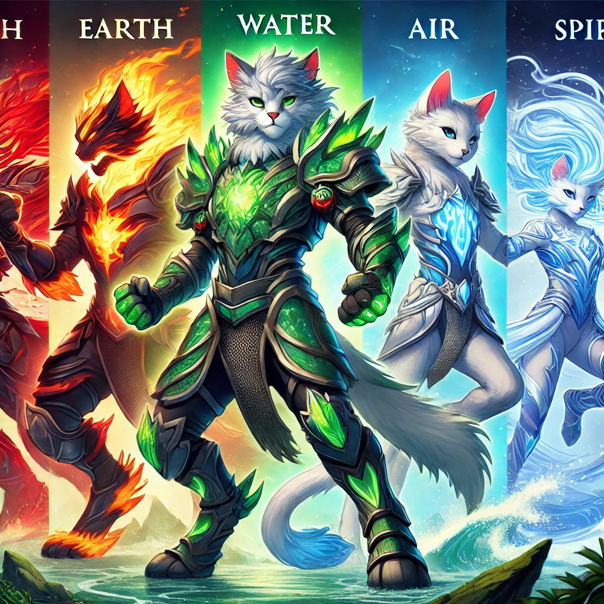
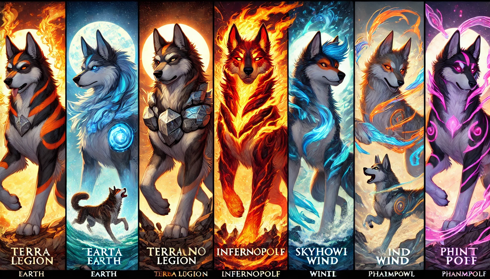

# PAWS GAME FI

In the world of PurrPaws Combat, a once-peaceful land has been thrown into chaos by a mysterious force known only as "The Shroud." The balance between realms of light and shadow is teetering, and the only hope for restoring harmony lies in the hands—or rather, paws—of a group of elite warriors: the PurrPaws Clan.

Each warrior in the PurrPaws Combat game is a feline fighter imbued with unique abilities tied to the ancient elements: Earth, Fire, Water, Air, and Spirit. The game is set in a sprawling fantasy world where players take control of their chosen warrior and engage in fast-paced, strategic combat to defeat the growing armies of shadow creatures and reclaim the land.

<figure><figcaption></figcaption></figure>

The game’s core narrative centers around the Great Feline Council, a powerful assembly of mystical cats who foresaw the coming of The Shroud. Led by the enigmatic Elder Claw, the Council created the PurrPaws Stones, magical artifacts scattered across the realms, each granting a warrior mastery over one of the elemental forces. To defeat the looming threat, warriors must journey through various lands, battle powerful enemies, and uncover the secrets hidden within each stone.

Players must form alliances, build strategies, and unleash powerful elemental abilities in thrilling battles, all while unraveling the secrets of The Shroud's origin. Every victory brings the PurrPaws Clan closer to reuniting the lost PurrPaws Stones and ultimately restoring the balance between light and shadow.

But the danger is ever-present, as The Shroud has corrupted many realms, turning once-friendly creatures into dark, menacing foes. Players must navigate intricate battlefields, solving puzzles and completing quests to purify the lands and recruit allies to their cause. With each level, the mystery deepens, revealing a larger, more sinister plot that threatens not only the feline world but the entire multiverse.

The combat in PurrPaws Combat is tactical, with each warrior having customizable skills, weapons, and elemental powers that can be upgraded as players progress through the game. Every battle is a test of strategy, with the warriors’ elemental affinities playing a key role in both offense and defense. Water warriors extinguish fire, Earth resists Air, and Spirit channels the ethereal forces of the universe, offering powerful support.

As the warriors grow stronger and unlock new abilities, they begin to uncover the truth behind The Shroud: an ancient force that predates even the Feline Council itself. Only by mastering the full potential of the PurrPaws Stones can the clan hope to confront this primal force and restore peace to the realms.

Players can also engage in competitive multiplayer combat, where they pit their customized PurrPaws warriors against others in arena-style battles to prove their dominance and secure their place in the legendary Feline Council.

The fate of the realms rests on the brave warriors of the PurrPaws Clan, and only through courage, wit, and skill will they stand a chance in the epic struggle against the Shroud. Will you lead your warrior to victory, or will darkness consume the lands forever? The answer lies in your paws.

***

&#x20;

<figure><figcaption></figcaption></figure>

On the opposite side of the PurrPaws Clan stands their rival, the Canine Legion, a fierce group of warriors known for their loyalty, discipline, and unyielding determination to protect their lands from the same looming threat: The Shroud. The Canine Legion is equally diverse, with each member representing a different elemental force and embodying a unique combat style.

Each warrior in the Canine Legion is a highly skilled combatant, with the following core representatives:

* TerraHound (Earth Dog): A towering mastiff with rock-hard fur and armor made of stone. TerraHound draws strength from the earth, creating powerful tremors and shields to defend against attacks. His brute strength is unmatched, and his loyalty to his pack is unwavering.
* InfernoPup (Fire Dog): A swift and fiery jackal whose red-orange fur crackles with embers. InfernoPup specializes in agile attacks, leaving trails of fire in his wake and launching explosive fireballs at his foes. His volatile temper fuels his fierce combat style.
* TideWolf (Water Dog): This sleek, blue-coated husky harnesses the power of the oceans, summoning tidal waves and using fluid, unpredictable movements in battle. TideWolf is calm and composed, relying on the ebb and flow of water to strike with precision.
* SkyHowl (Air Dog): A swift and agile greyhound, SkyHowl controls the wind itself, able to leap great distances and strike with the speed of a hurricane. His light armor, adorned with feathers, allows him to glide through the air, making him nearly untouchable in combat.
* PhantomPaw (Spirit Dog): A mystical wolf-like figure with translucent fur and glowing symbols. PhantomPaw exists between the realms of the living and the dead, able to phase through attacks and channel spirit energy to heal or unleash devastating spiritual blasts.

The Canine Legion believes in strict discipline and unity. While they respect the PurrPaws Clan, they are wary of the cats’ unpredictable nature and often find themselves in direct competition for control of the elemental realms. The ongoing tension between these two factions creates a dynamic and ever-shifting balance of power.

As The Shroud threatens both sides, the Canine Legion must decide whether to continue their rivalry with the PurrPaws or unite against the greater evil that seeks to destroy their world. Players who choose to fight on the side of the Canine Legion will face different challenges, battling not only the darkness but also the cunning and fierce warriors of the PurrPaws Clan.

The question remains: Will the two sides put aside their differences to save their world, or will their rivalry spell doom for all? In PurrPaws Combat, players can explore the epic saga from both perspectives, whether fighting as a fierce cat or a loyal dog in this high-stakes battle for survival.
