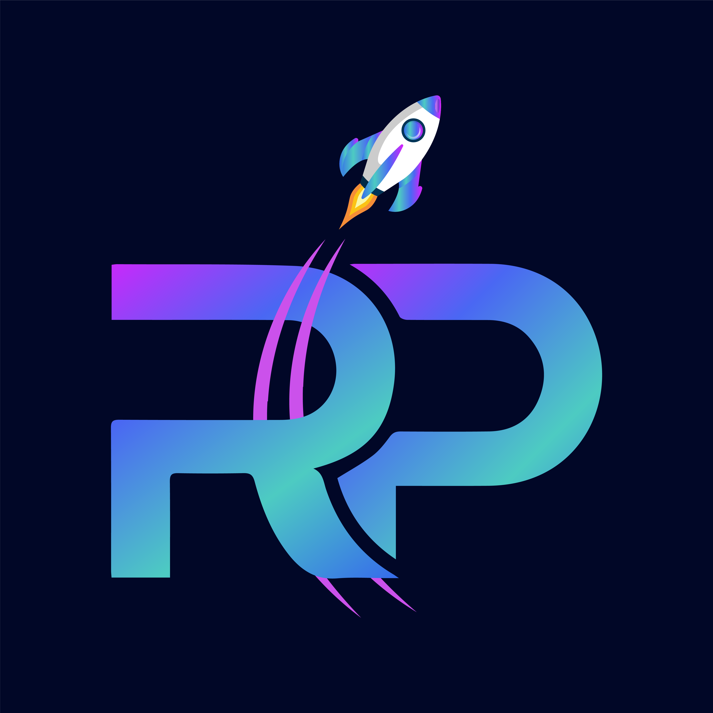

# 8. Key Utilities

## PAWS COMBAT - tApp GAME

* **PawsCombat\_bot:** A mini-game within the PurrPaws ecosystem that allows users to earn tokens by completing tasks and referring others.

<figure><figcaption></figcaption></figure>

## ROGER NFT

* RogerNFT: A platform to mint, trade, and monetize NFTs, fostering additional community engagement and utility for PurrPaws.

<figure><figcaption></figcaption></figure>

## ROGER PAD - Multi Chain Launch Pad

* RogerPad: A decentralized multi-chain launchpad that helps other projects raise funds, further bolstering the growth of the PurrPaws ecosystem.

<figure><figcaption></figcaption></figure>
